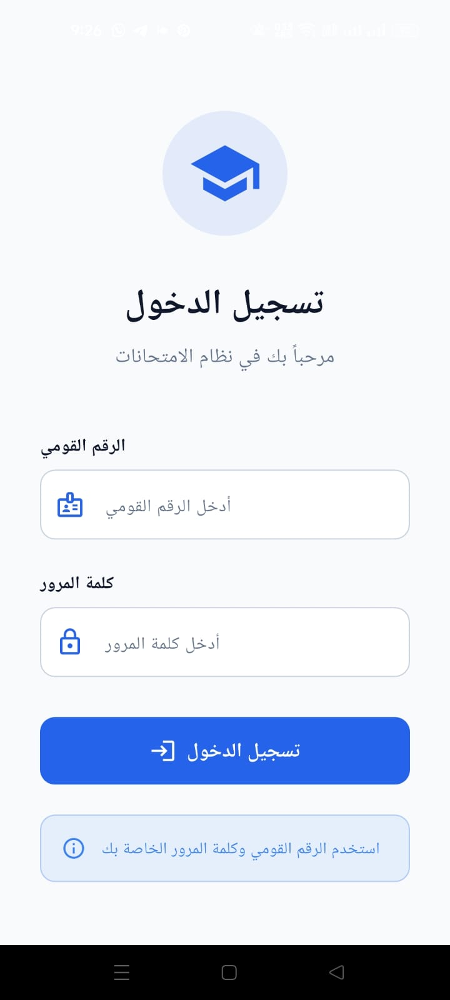
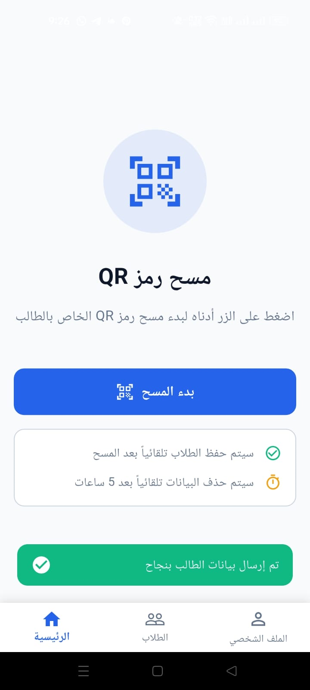
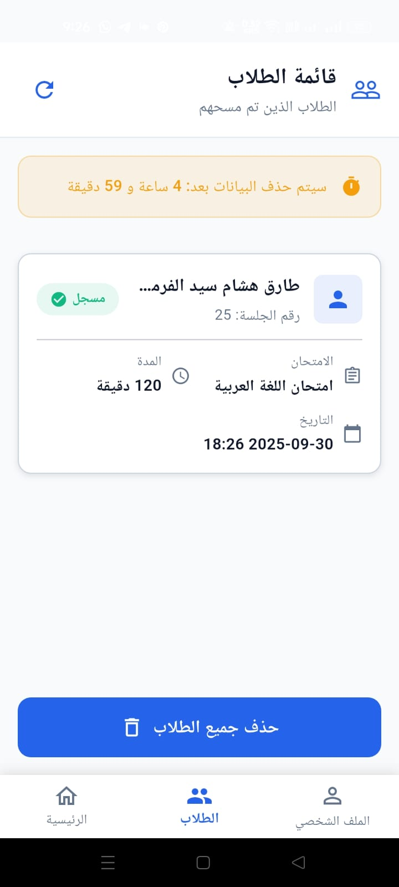
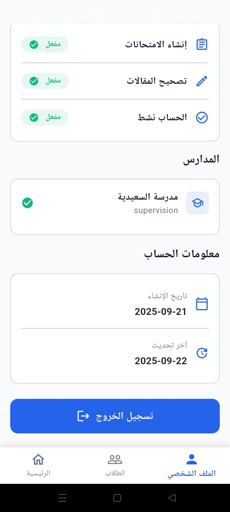

# 📱 Teacher Exam App

تطبيق Flutter احترافي للمعلمين لإدارة الامتحانات مع مسح QR Code ومتابعة الطلاب.

[Flutter]


## 📸 Screenshots

| Login Screen | Home Screen | Students List | Profile |

|  
| 
|  
|  |

---

## ✨ Features

- ✅ **تسجيل دخول آمن** - Authentication with National ID & Password
- ✅ **مسح QR Code** - Scan student QR codes
- ✅ **إدارة الطلاب** - Manage scanned students
- ✅ **حذف تلقائي** - Auto-delete after 5 hours
- ✅ **حفظ الجلسة** - Keep user logged in
- ✅ **ملف شخصي** - Display teacher information
- ✅ **واجهة عربية** - Full RTL support
- ✅ **تصميم عصري** - Modern Material Design 3

---

## 🏗️ Architecture

```
lib/
├── core/                  # Core functionality
│   ├── error/            # Error handling
│   ├── services/         # API & Cache services
│   ├── theme/            # App theme & colors
│   ├── utils/            # Constants & helpers
│   └── widgets/          # Reusable widgets
│
├── features/             # App features
│   ├── auth/            # Authentication
│   ├── home/            # Home & QR scanning
│   ├── students/        # Students management
│   └── profile/         # Teacher profile
│
└── main.dart            # Entry point
```

**Pattern:** Clean Architecture + BLoC (Cubit)

---

## 🚀 Getting Started

### Prerequisites

```bash
Flutter SDK: >=3.0.0
Dart SDK: >=3.0.0
Android Studio or VS Code
```

### Installation

1. **Clone the repository**
```bash
git clone https://github.com/yourusername/teacher_exam_app.git
cd teacher_exam_app
```

2. **Install dependencies**
```bash
flutter pub get
```

3. **Run the app**
```bash
flutter run
```

---

## 📦 Dependencies

```yaml
dependencies:
  flutter_bloc: ^8.1.6      # State management
  dio: ^5.4.3               # HTTP client
  shared_preferences: ^2.2.3 # Local storage
  mobile_scanner: ^5.1.1    # QR scanner
  equatable: ^2.0.5         # Value equality
  dartz: ^0.10.1            # Functional programming
  intl: ^0.19.0             # Internationalization
```

---

## 🔧 Configuration

### Android Setup

Add permissions in `android/app/src/main/AndroidManifest.xml`:

```xml
<manifest xmlns:android="http://schemas.android.com/apk/res/android">
    
    <!-- Add these permissions before <application> tag -->
    <uses-permission android:name="android.permission.CAMERA" />
    <uses-permission android:name="android.permission.INTERNET" />
    <uses-feature android:name="android.hardware.camera" android:required="false" />
    
    <application
        android:label="Teacher Exam App"
        android:name="${applicationName}"
        android:icon="@mipmap/ic_launcher"
        android:hardwareAccelerated="true">
        
        <!-- Your activity code here -->
        
    </application>
</manifest>
```

### Update build.gradle

In `android/app/build.gradle`:

```gradle
android {
    defaultConfig {
        minSdkVersion 21
        targetSdkVersion 34
    }
    
    buildTypes {
        release {
            shrinkResources true
            minifyEnabled true
            proguardFiles getDefaultProguardFile('proguard-android.txt'), 'proguard-rules.pro'
        }
    }
}
```

---

## 🌐 API Endpoints

### Base URL
```
https://exam-api.koyeb.app/api/v1
```

### Login
```http
POST /auth/login
Content-Type: application/json

{
  "national_id": "12345678909999",
  "password": "12345678"
}
```

**Response:**
```json
{
  "status": true,
  "message": "تم تسجيل الدخول بنجاح",
  "data": {
    "user": { ... },
    "access_token": "token_here",
    "token_type": "Bearer",
    "expires_at": "2025-10-29T12:18:19.000000Z"
  }
}
```

### Scan QR Code
```http
POST /teacher/scan-qr-create-session
Authorization: Bearer {token}
Content-Type: application/json

{
  "student_id": "123"
}
```

**Response:**
```json
{
  "status": true,
  "message": "تم السماح للطالب بدخول الامتحان",
  "data": {
    "session_id": 9,
    "student_name": "أحمد محمد",
    "exam_title": "امتحان الرياضيات",
    "exam_duration": 120,
    "created_at": "2025-09-29T16:08:08.000000Z"
  }
}
```

---

## 🧪 Testing

### Run tests
```bash
flutter test
```

### Test credentials
```
National ID: 12345678909999
Password: 12345678
```

---

## 📱 Build Release

### Build Android APK
```bash
flutter build apk --release
```
Output: `build/app/outputs/flutter-apk/app-release.apk`

### Build Android App Bundle (للنشر على Play Store)
```bash
flutter build appbundle --release
```
Output: `build/app/outputs/bundle/release/app-release.aab`

### Install APK on Device
```bash
flutter install
```

---

## 📊 Project Statistics

- **Lines of Code:** ~3,500
- **Number of Files:** 25+
- **Features:** 4 main features
- **Screens:** 6 screens
- **State Management:** Cubit
- **Architecture:** Clean Architecture

---

## 🎨 Color Palette

| Color | Hex | Usage |
|-------|-----|-------|
| Primary | `#2563EB` | Main theme color |
| Secondary | `#10B981` | Accent color |
| Success | `#10B981` | Success messages |
| Error | `#EF4444` | Error messages |
| Warning | `#F59E0B` | Warnings |

---

## 🤝 Contributing

Contributions are welcome! Please feel free to submit a Pull Request.

1. Fork the project
2. Create your feature branch (`git checkout -b feature/AmazingFeature`)
3. Commit your changes (`git commit -m 'Add some AmazingFeature'`)
4. Push to the branch (`git push origin feature/AmazingFeature`)
5. Open a Pull Request

---

## 📝 Code Style

This project follows the [Flutter Style Guide](https://flutter.dev/docs/development/tools/formatting)

Run formatter:
```bash
dart format .
```

Run analyzer:
```bash
flutter analyze
```

---

## 🐛 Known Issues

- QR scanner might need runtime permissions on Android 13+
- First launch requires camera permission approval

---

## 🔮 Future Enhancements

- [ ] Dark mode support
- [ ] Push notifications
- [ ] Offline mode
- [ ] Export students to Excel
- [ ] Biometric authentication
- [ ] Multi-language support
- [ ] Batch QR scanning
- [ ] Statistics dashboard

---

## 📄 License

This project is licensed under the MIT License - see the [LICENSE](LICENSE) file for details.

----

## 🙏 Acknowledgments

- Flutter Team for the amazing framework
- [mobile_scanner](https://pub.dev/packages/mobile_scanner) for QR code scanning
- [flutter_bloc](https://pub.dev/packages/flutter_bloc) for state management
- [Dio](https://pub.dev/packages/dio) for HTTP client

---

## 📞 Support

If you have any questions or issues, please [open an issue](https://github.com/yourusername/teacher_exam_app/issues).

---

## 🔗 Useful Links

- [Flutter Documentation](https://flutter.dev/docs)
- [Dart Documentation](https://dart.dev/guides)
- [BLoC Library](https://bloclibrary.dev/)
- [Material Design 3](https://m3.material.io/)

---

<div align="center">

**Made with ❤️ using Flutter**

⭐️ Star this repo if you like it!


</div>
